```
QQ联系我：1938667363

注意：以超级管理员身份登录系统时，若出现接口提示 “不允许访问”，请点击 “系统管理/系统权限/接口管理” 中的 “接口采集/校验” 按钮进行接口权限校验。
```


### 1. 需求背景

在项目实施过程中，难免会对接第三方系统并提供 API 服务，通常的方案是给对方一个 `token` 地址，对方想要获取 API 访问权限，需要通过地址获取 token ，并在目标请求的请求头中携带上 token。这样带来的问题是 `token 的颗粒度` 为 `整个项目的API` 。

对于另一些系统，可能在接口权限方面会有更加细致的控制，但是也存在其他一些问题问题，例如：硬编码导致的配置不灵活、 token 有效期的不灵活、调用限流的不灵活、接口下线难等诸多问题。

为了解决上述的诸多问题，有了 API 网关。API 网关为接口的 `访问控制` 、 `权限分配` 、 `流量限制` 、 `黑白名单` 、`客户端管理` 、 `日志采集` 等方面进行赋能。


API网关至少需要有如下的三个特性:

**接口的动态代理**

我们 `提供给第三方` 的接口服务必然是 `已经存在的接口服务` ，但是我们并不能直接通过该接口给第三方提供服务（因为访问控制很难），所以需要一层 `接口代理` ，我们通过动态配置提供给第三方新的接口（该接口只是对已存在服务接口的代理），实现接口代理的方案有很多，不是我们讨论的主题，不过多赘述。

**客户端配置**

我们对 `代理接口的访问控制` 就是基于 `客户端管理` 实现的，第三方调用 `代理接口` 时是需要 `携带 token` 的，`第三方需要通过客户端编号获取访问 token` ，通过客户端编号获取的 token 会携带客户端信息，使得 API 网关服务可以通过访问 token 直接解析出  `客户端状态`、 `客户端ttl`、 `token的ttl` 、 `客户端的接口权限` 等客户端的附庸属性。我们团队的方案是 token 中只携带客户端编号以及一些必要的标识，将客户端附庸属性（客户端编号对应的客户端状态、 客户端ttl、 token的ttl 、 客户端的接口权限等）保存到内存中，便于当修改 ttl 和接口权限后可立即生效，不受token获取时间的影响。

**前端可视化界面**

上述的动态代理以及客户端配置肯定是通过前端图形化界面进行操作的，所以我们需要一套完成的API网关管理界面，使得非专业人员可方便的进行配置，进一步提高了API网关的易用性。


### 2. 技术体系

`JDK8` + `SpringBoot` + `Vert.X` + `Redis` + `Vue3` + `Element-Plus`

```
使用 JDK8 以适用于绝大多数项目。利用 SpringBoot 开发的便捷性完成交互型功能的开发，包括应用、服务、API、白名单、客户端的配置交互的开发。Vert.X 是一个全异步非阻塞的 Netty 框架，非常适合 `vertx-gateway` 核心功能的开发，已达到良好的并发性。
```


下面是 `vertx-gateway` 模块的简单介绍

```
vertx-gateway                     # 根目录
  |_ vertx-gateway-admin          # 项目启动模块
  |_ vertx-gateway-common         # 功能模块，包括常量、实体、注解、工具类等
  |_ vertx-gateway-core           # 核心模块
    |_ vertx-gateway-core-api     # 实现了“路由”的上线、下线、更新逻辑
    |_ vertx-gateway-core-app     # 实现了“应用”的部署、卸载逻辑，包括IP白名单的织入
    |_ vertx-gateway-core-deploy  # 部署vert.x相关的AbstractVerticle
    |_ vertx-gateway-core-log     # 日志采集模块
    |_ vertx-gateway-core-token   # 获取token的服务
    |_ vertx-gateway-core-cluster # 实现支持多节点部署以及状态同步
  |_ vertx-gateway-server         # 实现 vertx-gateway 前后端交互的模块
    |_ vertx-gateway-api          # “路由”前端交互的后端实现
    |_ vertx-gateway-application  # “应用”前端交互的后端实现
    |_ vertx-gateway-classify     # “服务”前端交互的后端实现
    |_ vertx-gateway-client       # “客户端”前端交互的后端实现
    |_ vertx-gateway-log          # “日志”前端交互的后端实现
    |_ vertx-gateway-white-list   # “IP白名单”前端交互的后端实现
  |_ vertx-gateway-system         # vertx-gateway 的系统管理模块的后端实现
    |_ vertx-gateway-auth         # 系统权限管理模块的后端实现
    |_ vertx-gateway-menu         # 系统菜单管理模块的后端实现
    |_ vertx-gateway-org          # 系统组织机构管理模块的后端实现
    |_ vertx-gateway-params       # 系统参数管理模块的后端实现
    |_vertx-gateway-user          # 系统用户管理模块的后端实现
  |_ vertx-gateway-ui             # 前端服务，vue3工程
```


### 3. 功能描述

`vertx-gateway` 是一个完善的项目不仅仅只是 API 网关。除了核心功能（应用的挂载、API的注册、客户端的配置）以外，还包括完整的用户管理、菜单管理、权限管理（菜单、按钮、接口）。

`vertx-gateway` 核心分为三层结构：

```
应用1（8000）
  - 服务1-1
    - 接口1-1-1（get:/api/vertx-gateway/demo1）
    - 接口1-1-2（post:/api/vertx-gateway/demo2）
  - 服务1-2
      - 接口1-2-1（put:/api/vertx-gateway/demo3）
  - 服务1-3
应用2（8001）
  - 服务2-1
应用3（8002）
```

```
第1层：应用，一个应用代表一个端口，部署一个应用就表达多一个端口服务，在这个端口下可以注册 N 的路由（接口）。支持 http 和 https 两种协议，支持自定义端口，支持跨域配置，支持自定义应用核心参数。

第2层：服务，服务是挂载到应用下面的，其存在的意义是完成对路由（接口）的分类。

第3层：路由（接口），就是用户实际请求的的接口，同一个应用下的路由的 path 不可重复。配置 API 网关 中的 API 的，也可以认为是 “代理配置”。
 - 支持自定义路由 Path、Method、接收的 Content-Type。
 - 支持配置 query、path、header 参数，可配置访问限制，例如 每分钟/小时/天 路由的访问上限。
 - 支持鉴权、鉴权两种策略，非鉴权下用户访问网管路由无需访问 token 即可访问。
 - 支持 “http/https” 、"重定向"类型代理配置，“http/https” 类型的代理支持配置多个 URL，支持两种负载均衡策略（轮询、IP 哈希），支持配置代理“常量参数”。
 - 支持代理超时重试，可自定义重试次数和重试间隔。

---------------------------------------

除此之外，vertx-gateway 还支持配置 IP 白名单，全链路的日志采集功能。在权限控制方面有“授权中心”，用户在授权中心中可配置N个客户端，每个客户端的有效期可习性设置，用户通过客户端 code 获取访问 token，单次访问 token 的有效期可自行配置，每个客户端可自行配置允许访问的路由（接口）。
```


### 4. 集群部署

`vertx-gateway` 属于有状态的服务，但是 `vertx-gateway` 依然支持集群（多节点/分布式）部署。

`vertx-gateway` 采用的是去中心化的集群方案，集群部署方式无感，当你想要对 `vertx-gateway` 节点进行扩充以实现 `vertx-gateway` 的吞吐量时，只需多启动 N 个 `vertx-gateway` 节点即可， 不同的 `vertx-gateway` 节点之间会进行状态自同步，无需任何多余的配置。


### 5. 获取TOKEN

当路由配置的是 “鉴权策略” 的时候，三方系统在访问网管路由的时候，需要携带访问 token ，三方系统可通过如下方案获取访问token。

当 `vertx-gateway` 项目启动后，会打印出 token 的请求地址，如下：


在 “授权中心” 配置好客户端后，三方系统通过客户端编号获取访问token，如下：

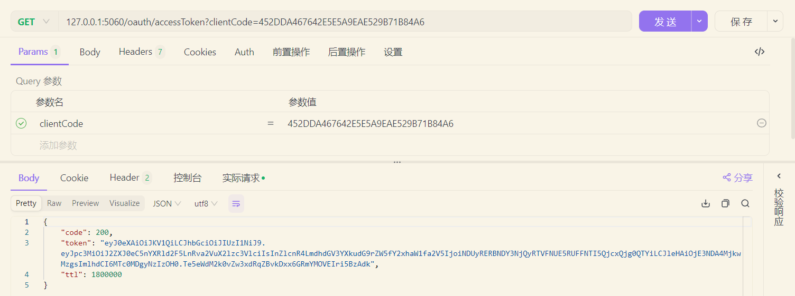

三方系统在访问网关路由时，在请求头中携带token即可，请求头的名称在这个可看，可自定义修改：

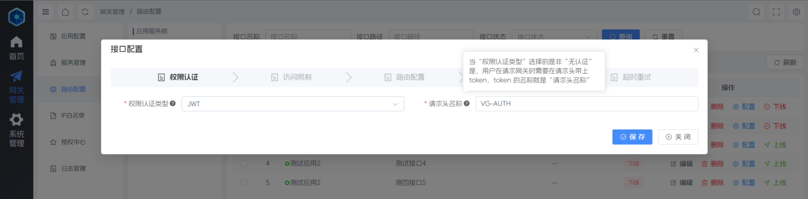


### 6. 系统截图

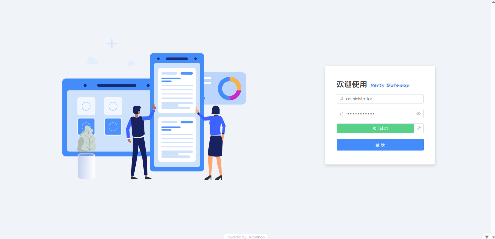

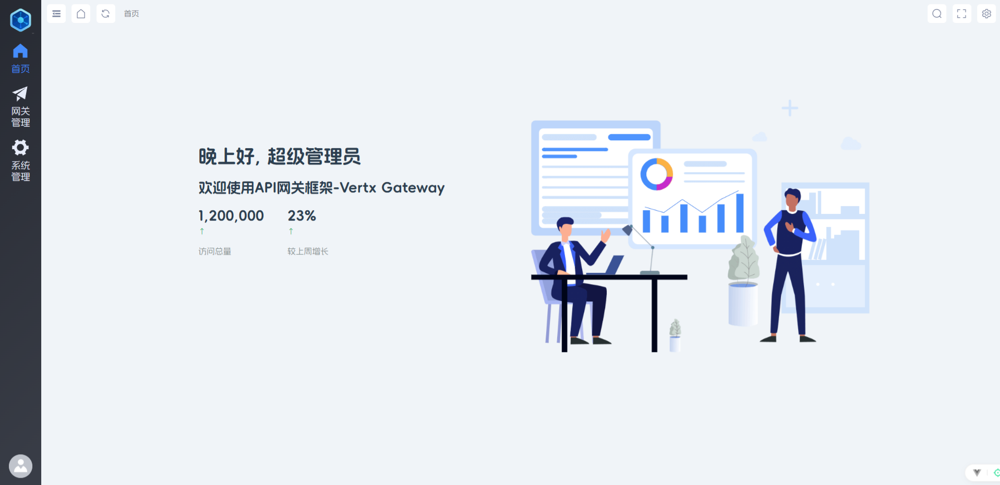

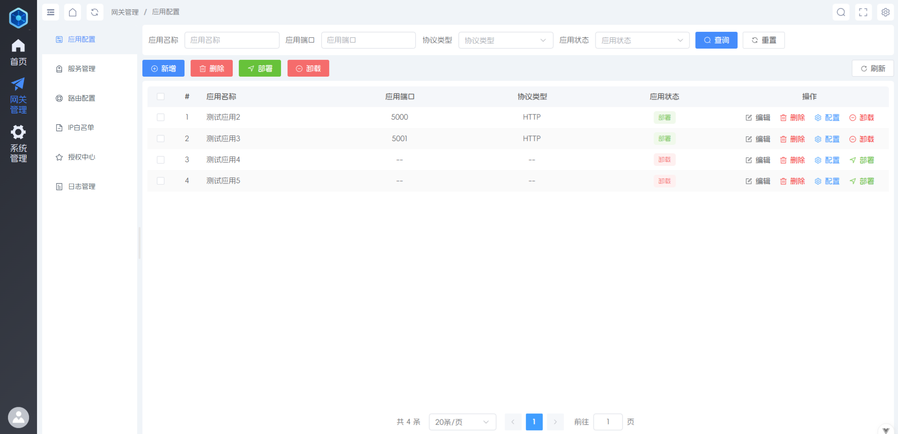

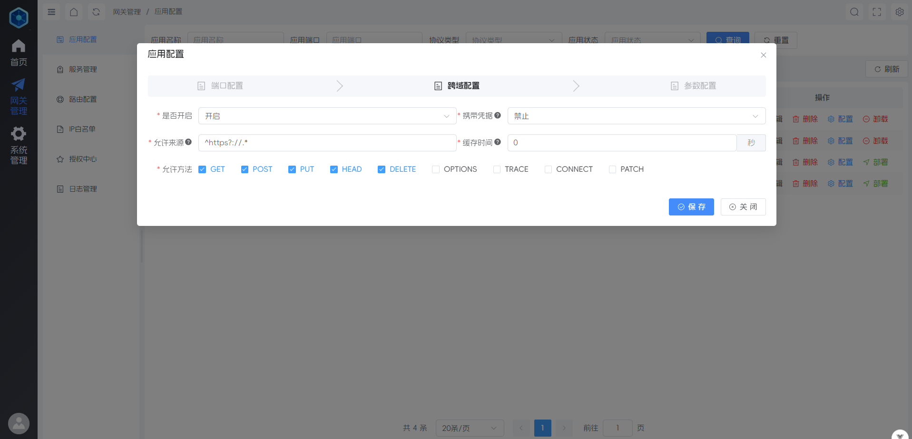

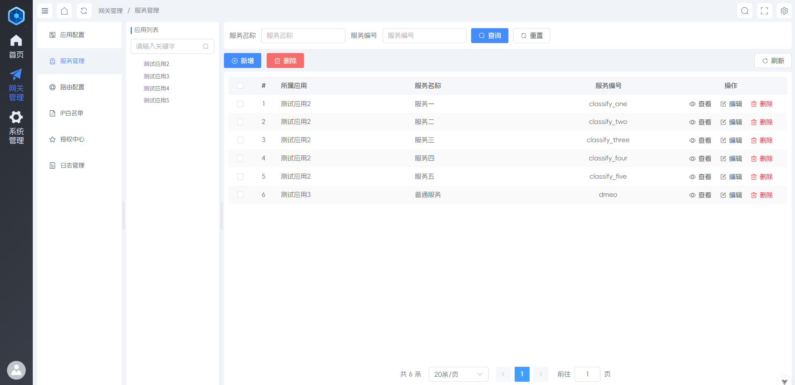

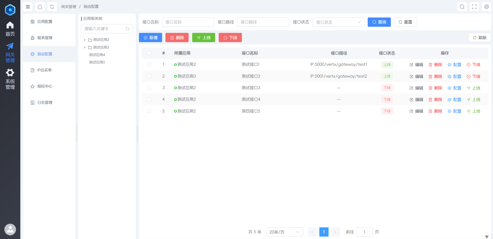

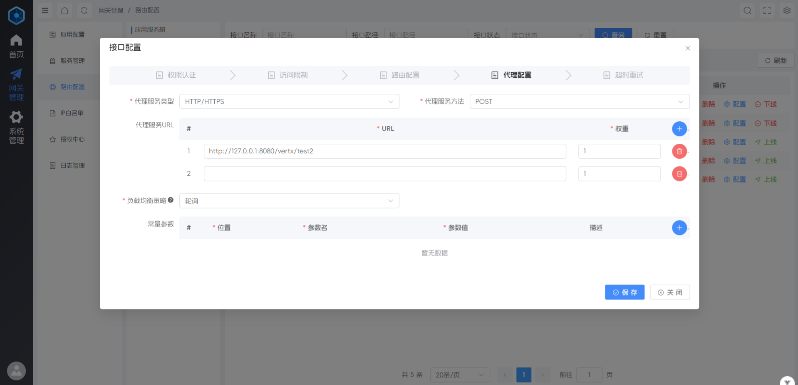

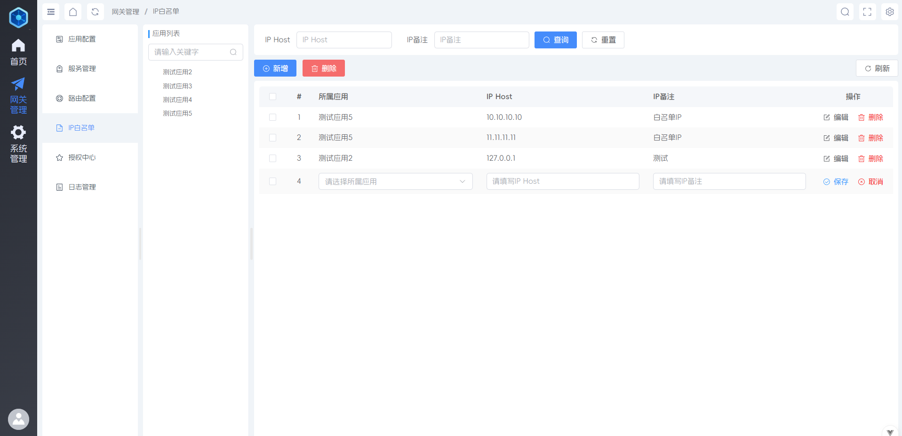

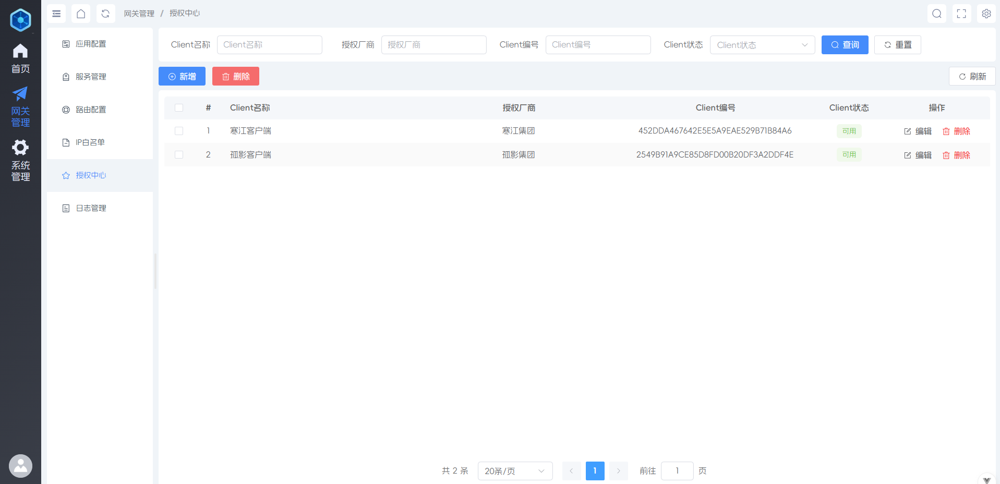

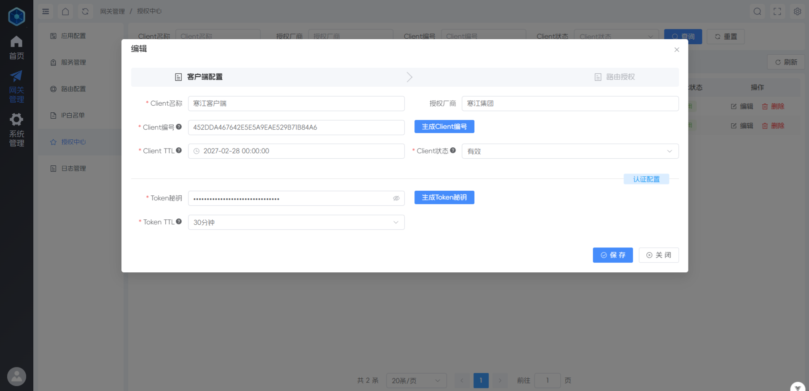

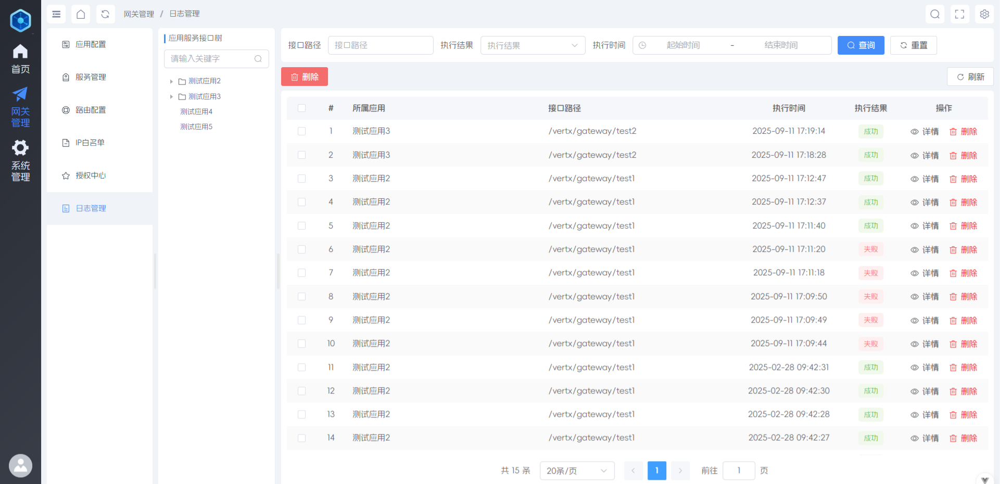

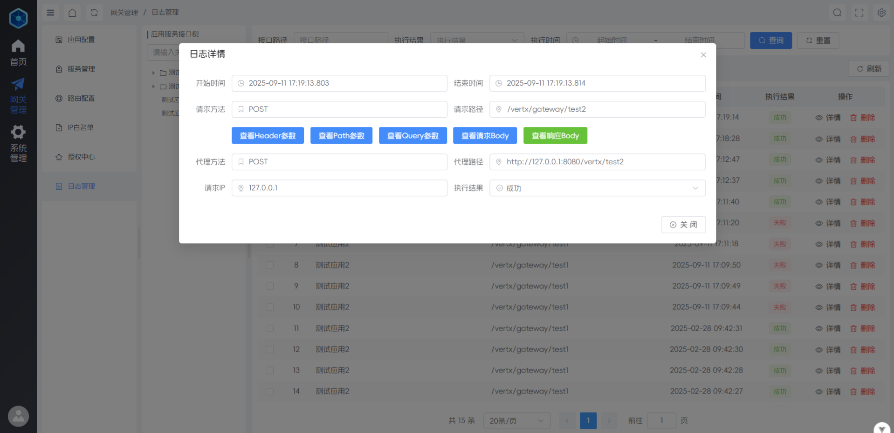

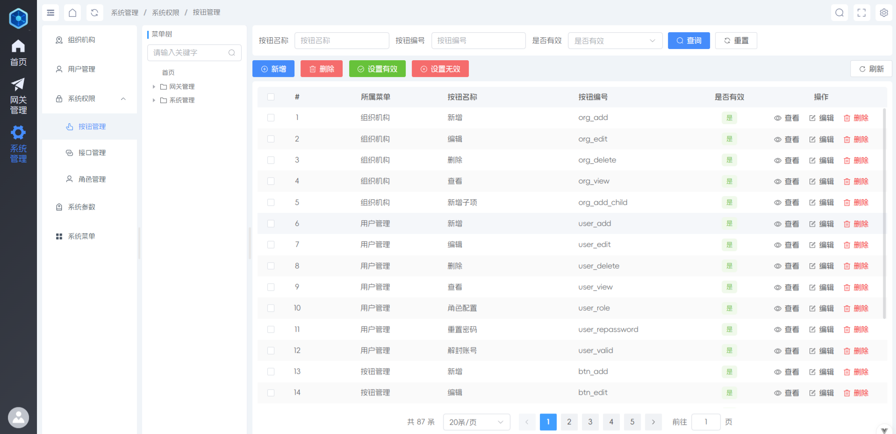

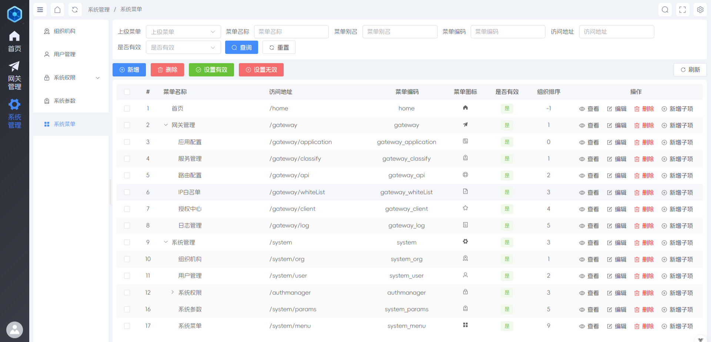